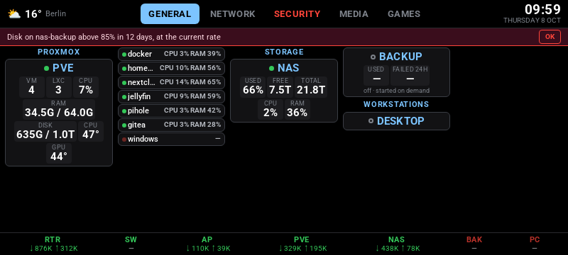
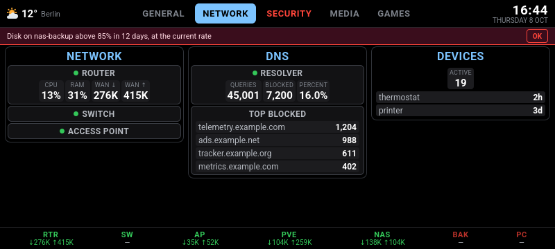
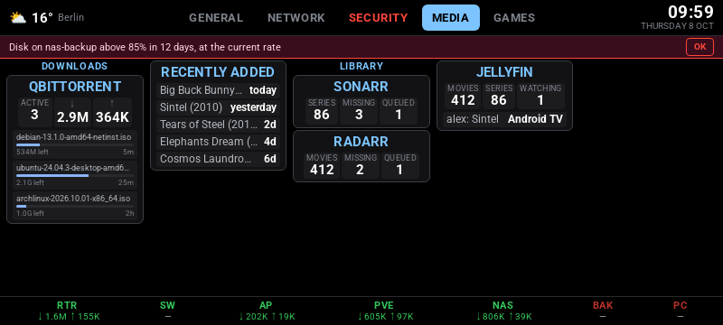
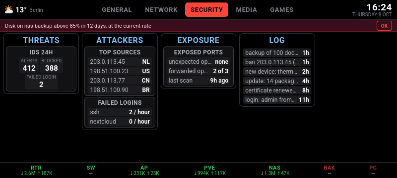
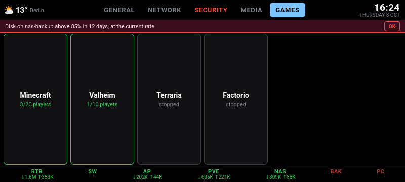
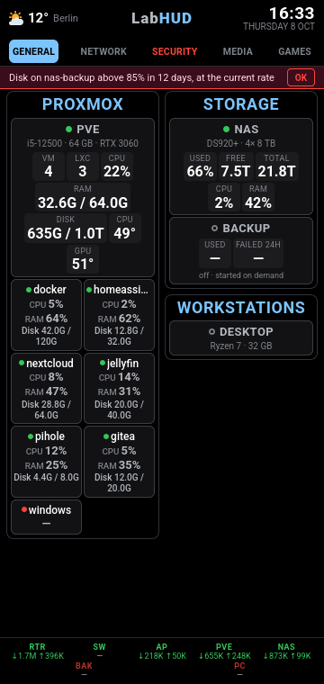

# labhud

A wall-mounted status display for your homelab. One page, designed for an old phone or tablet
on the wall: hosts, VMs, network, storage, backups and media at a glance, with live updates.



- **Zero dependencies.** Python standard library on the server, plain JS in the browser, no build step.
- **No secrets in the browser.** One server talks to your services; the screen only receives a
  snapshot over Server-Sent Events.
- **A setup page on first start.** Start it on an empty folder, open the link from its log, and
  it walks you through Proxmox (nodes, VMs, LXCs), every other service (tried before it is
  kept) and the display, then writes the config and starts. `init.py agent <name>` adds any
  Linux machine with one `curl | sh` line; `init.py edit` opens the config in a browser.
- **Optional sources.** Proxmox VE (guests, backups, snapshots, storage running out), Proxmox
  Backup Server, OPNsense, Synology DSM, OpenMediaVault, Docker (with `labhud.*` labels), a UPS
  through NUT, certificate expiry, Technitium / Pi-hole / AdGuard, Beszel, Uptime Kuma,
  Healthchecks, Scrutiny, Traefik, What's Up Docker, qBittorrent, the *arr apps, Jellyfin,
  Navidrome, Seerr, Immich, Speedtest Tracker, Home Assistant, game servers (Steam A2S,
  Minecraft), RSS, GitHub releases, a CalDAV calendar: each one turns on when you give it a URL
  and a key. Any other JSON API comes in without code.
- **Made for a wall.** Problems take the screen; numbers past a mark notify after 5 minutes, not
  on every spike; a calm mode shows only the clock when all is well; Fully Kiosk's screen goes
  off at night; a separate public status page shows names and states only.
- **One config file** (TOML) describing your pages and cards, reloaded on save.
- **Demo mode** with made-up data, so you can try it without touching your lab.

> [!WARNING]
> labhud has **no login**. The page shows your internal addresses and, if you enable actions,
> buttons that act on your lab. Keep it behind a firewall rule that lets only the display in, or
> behind a VPN. See [docs/security.md](docs/security.md).

## Try it

```sh
docker run --rm -p 127.0.0.1:8095:8095 -e LABHUD_DEMO=1 ghcr.io/mithrandler/labhud:latest
```

Then open <http://localhost:8095>. No keys, no network access, nothing from your lab.

## Install

[docs/install.md](docs/install.md): config, keys, Docker Compose, the display, updates.

| | |
|---|---|
|  |  |
|  |  |

In portrait the same page gets two columns, and the project name takes the free middle of the top bar:



## Docs

- [docs/install.md](docs/install.md): installing and updating; `/status` for what is not working
- [docs/sources.md](docs/sources.md): per service, the key to create, the least rights it needs, a card to start from
- [docs/security.md](docs/security.md): what the page reveals and what to put in front of it
- [docs/architecture.md](docs/architecture.md): every connection, its direction, port and key
- [docs/threat-model.md](docs/threat-model.md): what labhud protects, against whom, and the known gaps
- [docs/live-agent.md](docs/live-agent.md): your own data (alerts, DNS, logins, game servers) as one JSON document
- [docs/actions.md](docs/actions.md): buttons that wake hosts or start VMs (off by default)
- [docs/integrations.md](docs/integrations.md): Docker, NUT, certificates, DNS filters, Beszel, Uptime Kuma, Healthchecks, Scrutiny, Traefik, feeds, the screen, the public page, MQTT and Home Assistant
- [config.example.toml](config.example.toml): every config option, commented
- [.env.example](.env.example): every source and the variables it reads
- [CHANGELOG.md](CHANGELOG.md) · [docs/ROADMAP.md](docs/ROADMAP.md)

## Development

Standard library only, so the tests need nothing but Python 3.11+ (and Node for the syntax check):

```sh
LABHUD_DEMO=1 python3 server.py                # the demo, on http://localhost:8095
python3 -m unittest discover -s tests -t .     # config loader, source parsers, demo smoke test
node --check static/app.js
```

The source tests run on made-up API answers in `tests/fixtures/`, one file per service, keyed by
a fragment of the requested URL. CI (`.github/workflows/ci.yml`) runs the same commands, then
builds the image for linux/amd64 and linux/arm64; a `vX.Y.Z` tag publishes it, once
`CHANGELOG.md` has an entry for that version.

## License

[MIT](LICENSE). The bundled Roboto fonts are under the
[SIL Open Font License 1.1](static/fonts/OFL.txt).
